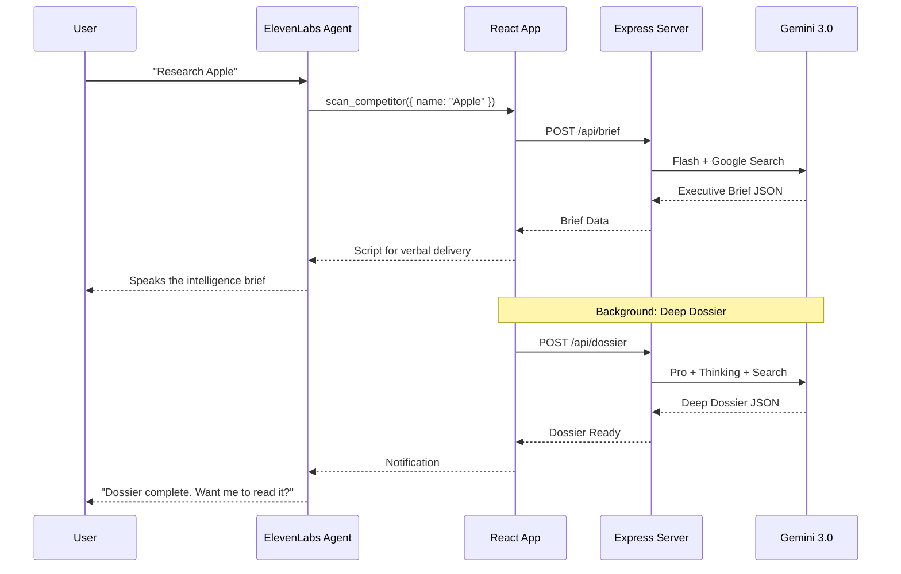

<div align="center">


# ATHENA
### Autonomous Competitive Intelligence Platform

**AI Accelerate Hackathon 2025 | ElevenLabs Challenge**

[](https://opensource.org/licenses/MIT)
[](https://cloud.google.com/)
[](https://elevenlabs.io/)

</div>

---

## 🎯 Overview

**Athena** is a voice-first competitive intelligence platform that transforms strategic research into an interactive conversation. Simply speak a company name, and Athena's AI agent instantly delivers an executive-grade strategic assessment—complete with risk analysis, competitive positioning, and actionable directives.

Built for the **ElevenLabs Challenge**, Athena combines the natural conversational abilities of ElevenLabs' voice AI with the deep analytical power of Google's Gemini 3.0 models to create an experience that feels like briefing a seasoned intelligence analyst.

---

## ✨ Features

### 🎙️ Voice-First Intelligence Interface
- **Natural Language Interaction**: Speak naturally to request intelligence on any public company
- **Real-Time Voice Responses**: The AI agent verbally delivers strategic assessments with a professional, analyst-like persona
- **Conversational Context**: Follow-up questions and clarifications handled seamlessly

### 📊 Dual-Path Analysis Engine
| Path | Model | Purpose | Speed |
|------|-------|---------|-------|
| **Flash Path** | Gemini 3.0 Flash | Executive Brief with key signals | ~3-5 seconds |
| **Thinking Path** | Gemini 3.0 Pro + Thinking | Deep Dossier with comprehensive research | ~30-60 seconds |

### 🎯 Executive Intelligence Brief (Fast Path)
- **Strategic Frame**: One-sentence thesis capturing the company's current strategic posture
- **Scenario Analysis**: Most likely path vs. second-most-dangerous scenario
- **Operational Directive**: Actionable counter-measure recommendation
- **Confidence Band**: HIGH/MEDIUM/LOW with resolving signals
- **Flip Condition**: Observable event that would change the recommendation

### 📋 Deep Strategic Dossier (Slow Path)
- **Executive Summary**: Bottom-line-up-front judgment
- **Market Friction Analysis**: Structural headwinds and growth barriers
- **Competitive Lethality**: Who is actually threatening them and how
- **Operational Reality**: Financial health, leadership, product velocity
- **The Alpha**: Unique insight the market is missing
- **Cited Sources**: All claims backed by real-time Google Search results

### 📥 Exportable Intelligence Artifacts
- **HTML Dossier Export**: Download a beautifully formatted intelligence report
- **Print-Ready Layout**: Professional document styling with proper pagination
- **Reference Links**: All sources preserved for verification

### 🔊 Session Management
- **Terminate Uplink**: Clean session termination that aborts all in-flight requests
- **State Preservation**: No stale data leaks between sessions

---

## 🛠️ Technology Stack

### Google Cloud AI
| Technology | Usage |
|------------|-------|
| **Gemini 3.0 Flash Preview** | Fast executive brief generation with Google Search grounding |
| **Gemini 3.0 Pro Preview + Thinking** | Deep strategic analysis with extended reasoning (1024 thinking budget) |
| **Google Search Tool** | Real-time web search for current intelligence |
| **@google/genai SDK** | Server-side API integration |

### ElevenLabs
| Technology | Usage |
|------------|-------|
| **Conversational AI Agents** | Voice-driven user interaction |
| **@elevenlabs/client SDK** | React integration for real-time voice streaming |
| **Client Tools API** | Custom tool registration (`scan_competitor`, `consult_dossier`) |

### Frontend
| Technology | Usage |
|------------|-------|
| **React 19** | Component architecture |
| **Framer Motion** | Fluid animations and state transitions |
| **Tailwind CSS** | Utility-first styling |
| **Vite** | Fast development and optimized builds |
| **React Markdown** | Rendering structured AI responses |

### Backend
| Technology | Usage |
|------------|-------|
| **Node.js + Express** | API server |
| **Structured JSON Schemas** | Enforced response formats via Gemini's native schema support |

### Deployment
| Technology | Usage |
|------------|-------|
| **Google Cloud Run** | Containerized deployment |
| **Docker** | Container image |

---

## 🚀 Quick Start

### Prerequisites
- Node.js 18+
- Google Cloud API Key (Gemini access)
- ElevenLabs Agent ID (with `scan_competitor` and `consult_dossier` tools configured)

### Installation

```bash
# Clone the repository
git clone https://github.com/inflexion88/athena-CI.git
cd athena-CI

# Install dependencies
npm install

# Configure environment
cp .env.example .env
# Edit .env with your API keys:
#   GEMINI_API_KEY=your_google_api_key
#   ELEVENLABS_AGENT_ID=your_agent_id

# Run locally
npm run dev
```

### Environment Variables

| Variable | Description |
|----------|-------------|
| `GEMINI_API_KEY` | Google AI API key for Gemini models |
| `ELEVENLABS_AGENT_ID` | Your ElevenLabs Conversational AI Agent ID |

---

## 🎤 ElevenLabs Agent Configuration

Your ElevenLabs Agent must be configured with the following tools in the dashboard:

### Tool: `scan_competitor`
```json
{
  "name": "scan_competitor",
  "description": "Analyze a company and return strategic intelligence",
  "parameters": {
    "name": { "type": "string", "description": "Company name to analyze" },
    "url": { "type": "string", "description": "Optional company URL" }
  }
}
```

### Tool: `consult_dossier`
```json
{
  "name": "consult_dossier",
  "description": "Read specific sections from the deep strategic dossier",
  "parameters": {
    "section": { "type": "string", "description": "Section to read" }
  }
}
```

---

## 📖 How It Works



---

## 🏆 Hackathon Submission

**Challenge**: ElevenLabs Challenge  
**Track**: AI Accelerate Hackathon - Google Cloud Partnerships

### Judging Criteria Alignment

| Criterion | Implementation |
|-----------|----------------|
| **Technological Implementation** | Production-grade integration of Gemini 3.0 (Flash + Pro with Thinking) and ElevenLabs Conversational AI with structured schemas, real-time search grounding, and session management |
| **Design** | Premium dark-mode executive HUD with fluid animations, responsive layout, and export-ready document generation |
| **Potential Impact** | Democratizes competitive intelligence for executives, investors, and strategists who need rapid, voice-accessible market insights |
| **Quality of the Idea** | Unique fusion of voice-first UX with dual-speed AI analysis (instant brief + deep research), delivering Wall Street-grade intelligence through natural conversation |

---

## 📝 License

This project is licensed under the MIT License - see the [LICENSE](LICENSE) file for details.

---

<div align="center">

**Built with 🎙️ ElevenLabs + 🧠 Google Gemini**

</div>
